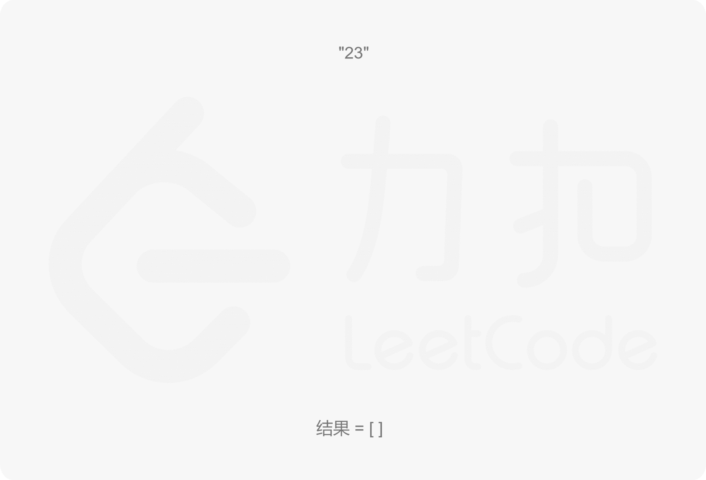
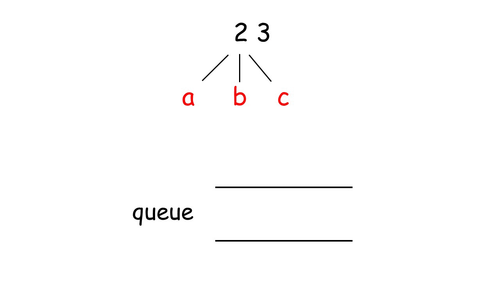

## 题目 🔥🔥中等
给定一个仅包含数字`2-9`的字符串，返回所有它能表示的字母组合。答案可以按 `任意顺序` 返回。

给出数字到字母的映射如下（与电话按键相同）。注意 `1`不对应任何字母。


### 示例 1：
```bash
输入：digits = "23"
输出：["ad","ae","af","bd","be","bf","cd","ce","cf"]
```

### 示例 2：
```bash
输入：digits = ""
输出：[]
```

### 示例 3：
```bash
输入：digits = "2"
输出：["a","b","c"]
```

### 提示：

- `0 <= digits.length <= 4`
- `digits[i] 是范围 ['2', '9'] 的一个数字。`

## 解题

### 解法一 回溯
对于有`所有组合`这样的字眼，我们很快会联想到`回溯`方法来解决；
对于而言本题，主要的思路有一下：
- 首先用`哈希表`将`数字`和`字母`的映射存起来；
- 回溯过程中维护一个字符串，表示已有的字母排列（如果未遍历完电话号码的所有数字，则已有的字母排列是不完整的）
- 该字符串初始为空
- 每次取电话号码的一位数字，从哈希表中获得该数字对应的所有可能的字母，并将其中的一个字母插入到已有的字母排列后面，然后继续处理电话号码的后一位数字，直到处理完电话号码中的所有数字，即得到一个完整的字母排列
- 然后进行回退操作，遍历其余的字母排列

**动画演示如下：⬇️**


**复杂度：**
- 时间复杂度：O(3<sup>m</sup> x 4<sup>n</sup>  其中 `m` 是输入中对应 `3` 个字母的数字个数;`n` 是输入中对应 `4` 个字母的数字个数;
- 空间复杂度：O(m+n)

#### **javascript**
- DFS:深度优先搜索
```js
/**
 * @param {string} digits
 * @return {string[]}
 */
var letterCombinations = function(digits) {
    let res = []
    if(digits.length==0) return res;
    let n = digits.length;
    let map = { //建立数字与字母的映射关系
        '2':'abc',
        '3':'def',
        '4':'ghi',
        '5':'jkl',
        '6':'mno',
        '7':'pqrs',
        '8':'tuv',
        '9':'wxyz'
    }
    //递归调用搜索
    const DFS = (curStr,i)=>{ //curStr 当前的字符串 i:指针的指向
        if(i > n -1){   //指针越界 递归出口
            res.push(curStr);
            return
        }

        let letters = map[digits[i]];
        for(let letter of letters){
            DFS(curStr+letter,i+1) //组成新的字符串，指针向后移动一位，继续递归
        }
    }
    DFS('',0);
    return res;
};
```
- BFS：广度优先搜搜
```js
/**
 * @param {string} digits
 * @return {string[]}
 */
var letterCombinations = function(digits) {
    if(digits.length == 0) return [];
    let map = { //建立数字与字母的映射关系
                '2':'abc',
                '3':'def',
                '4':'ghi',
                '5':'jkl',
                '6':'mno',
                '7':'pqrs',
                '8':'tuv',
                '9':'wxyz'
            }
    const queue = [];
    queue.push('');
    for(let i = 0;i < digits.length;i++){
        let nodeSize = queue.length  //当前层的节点数
        for(let j = 0;j < nodeSize;j++){
            //当前层的每一个节点都出列
            let curStr = queue.shift();
            let letters = map[digits[i]]
            for(let letter of letters){
                queue.push(curStr + letter)
            }
        }
    }
    return queue;
};
```

#### **typescript**
- DFS：深度优先搜索
```ts
function letterCombinations(digits: string): string[] {
  let res:string[] = []
  if(digits.length==0) return res;
  let n = digits.length;
  let map = { //建立数字与字母的映射关系
    '2':'abc',
    '3':'def',
    '4':'ghi',
    '5':'jkl',
    '6':'mno',
    '7':'pqrs',
    '8':'tuv',
    '9':'wxyz'
  }
  //递归调用搜索
  const DFS = (curStr:string,i:number):void=>{ //curStr 当前的字符串 i:指针的指向
    if(i > n -1){   //指针越界 递归出口
      res.push(curStr);
      return
    }

    let letters:string[] = map[digits[i]];
    for(let letter of letters){
      DFS(curStr+letter,i+1) //组成新的字符串，指针向后移动一位，继续递归
    }
  }
  DFS('',0);
  return res;

};
```
- BFS：广度优先搜索
```ts
function letterCombinations(digits: string): string[] {
    if(digits.length == 0) return [];
    let map = { //建立数字与字母的映射关系
                '2':'abc',
                '3':'def',
                '4':'ghi',
                '5':'jkl',
                '6':'mno',
                '7':'pqrs',
                '8':'tuv',
                '9':'wxyz'
            }
    const queue:string[] = [];
    queue.push('');
    for(let i = 0;i < digits.length;i++){
        let nodeSize = queue.length  //当前层的节点数
        for(let j = 0;j < nodeSize;j++){
            //当前层的每一个节点都出列
            let curStr = queue.shift();
            let letters = map[digits[i]]
            for(let letter of letters){
                queue.push(curStr + letter)
            }
        }
    }
    return queue;
};
```

### 解法二 队列
使用队列，先将输入的 `digits` 中第一个数字对应的每一个字母入队，然后将出队的元素与第二个数字对应的每一个字母组合后入队...直到遍历到 `digits` 的结尾。最后队列中的元素就是所求结果。
**动画演示：⬇️**


#### **jvascript**
```js
/**
 * @param {string} digits
 * @return {string[]}
 */
var letterCombinations = function(digits) {
  if (!digits) return [];
  const mapping = {
    '2': 'abc',
    '3': 'def',
    '4': 'ghi',
    '5': 'jkl',
    '6': 'mno',
    '7': 'pqrs',
    '8': 'tuv',
    '9': 'wxyz'
  };
  const queue = [''];
  for (let i = 0; i < digits.length; i++) {
    const letters = mapping[digits[i]];
    const size = queue.length;
    for (let j = 0; j < size; j++) {
      const curr = queue.shift();
      for (let k = 0; k < letters.length; k++) {
        queue.push(curr + letters[k]);
      }
    }
  }
  
  return queue;
};

```


#### **typescript**
```ts
function letterCombinations(digits: string): string[] {
if (!digits) return [];
  const mapping:{[key: string]: string} = {
    '2': 'abc',
    '3': 'def',
    '4': 'ghi',
    '5': 'jkl',
    '6': 'mno',
    '7': 'pqrs',
    '8': 'tuv',
    '9': 'wxyz'
  };
  const queue:string[] = [''];
  for (let i = 0; i < digits.length; i++) {
    const letters:string = mapping[digits[i]];
    const size:number = queue.length;
    for (let j = 0; j < size; j++) {
      const curr = queue.shift();
      for (let k = 0; k < letters.length; k++) {
        queue.push(curr + letters[k]);
      }
    }
  }
  return queue;
}
```
