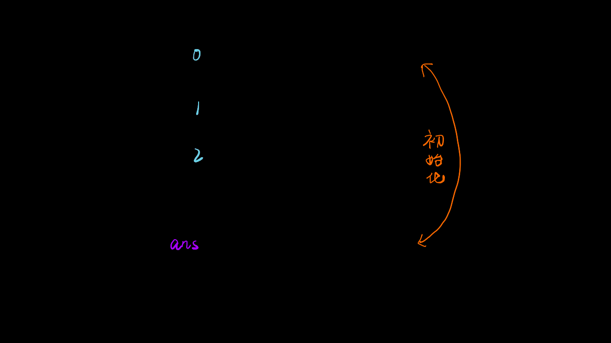

## 题目 🔥简单

编写一个函数来查找字符串数组中的最长公共前缀。

如果不存在公共前缀，返回空字符串 `""`。

### 示例 1：
```bash
输入：strs = ["flower","flow","flight"]
输出："fl"
````
### 示例 2：
```bash
输入：strs = ["dog","racecar","car"]
输出：""
解释：输入不存在公共前缀。
 
```
### 提示：

- `1 <= strs.length <= 200`
- 0 <= strs[i].length <= 200
- strs[i] 仅由小写英文字母组成

## 解题

### 解题思路
- 当字符串数组长度为 0 时则公共前缀为空，直接返回；
- 令最长公共前缀 ans 的值为第一个字符串，进行初始化；
- 遍历后面的字符串，依次将其与 ans 进行比较，两两找出公共前缀，最终结果即为最长公共前缀；
- 如果查找过程中出现了 ans 为空的情况，则公共前缀不存在直接返回；

**动画图解**


javascript

```js
/**
 * @param {string[]} strs
 * @return {string}
 */
var longestCommonPrefix = function(strs) {
    let n = strs.length;
    let maxS = strs[0];
    for(let i = 1;i < n;i++){
        let j
        for( j = 0; j < Math.min(maxS.length,strs[i].length);j++){
            if(maxS[j] === strs[i][j]){
                continue
            }else break;
        }
        maxS = maxS.substring(0,j)
    }
    return maxS
};
```

typescript

```ts
function longestCommonPrefix(strs: string[]): string {
  if (strs.length === 1) {
    return strs[0];
  }

  strs = strs.sort((a, b) => a === b ? 0 : a > b ? 1 : -1 );

  const shortest = strs[0];
  const longest = strs[strs.length - 1];

  let prefix = '';

  for (let index = 0; index < shortest.length; index++) {
    if (shortest[index] === longest[index]) {
      prefix += shortest[index];
    } else {
      return prefix;
    }
  }

  return prefix;
};
```
