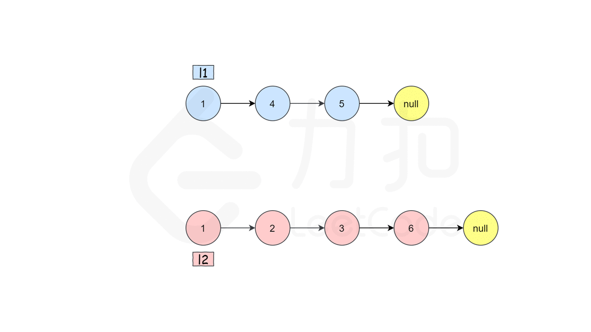

## 题目 简单
将两个升序链表合并为一个新的 升序 链表并返回。新链表是通过拼接给定的两个链表的所有节点组成的。

### 示例 1


```bash
输入：l1 = [1,2,4], l2 = [1,3,4]
输出：[1,1,2,3,4,4]
```

### 示例 2：
```bash
输入：l1 = [], l2 = []
输出：[]
```

### 示例 3：
```bash
输入：l1 = [], l2 = [0]
输出：[0]
```

### 提示：

- `两个链表的节点数目范围是 [0, 50]`
- `-100 <= Node.val <= 100`
- `l1 和 l2 均按 非递减顺序 排列`

## 题解
### 迭代

**解题思路：⬇️**
这题算链表中比较简单的一道题了，通过判断节点的val进行链表的拼接即可


**javascript：⬇️**

```js
/**
 * Definition for singly-linked list.
 * function ListNode(val, next) {
 *     this.val = (val===undefined ? 0 : val)
 *     this.next = (next===undefined ? null : next)
 * }
 */
/**
 * @param {ListNode} list1
 * @param {ListNode} list2
 * @return {ListNode}
 */
var mergeTwoLists = function(list1, list2) {
    if(!list1) return list2;
    if(!list2) return list1;

    let dummy = new ListNode()
    let cur = dummy;
    while(list1&&list2){
        if(list1.val>list2.val){
            cur.next = list2
            list2 = list2.next
        }else{
            cur.next = list1
            list1 = list1.next
        }
        cur = cur.next
    }
    cur.next = list1 ? list1 : list2;
    return dummy.next
};
```

**typescript：⬇️**

```ts
/**
 * Definition for singly-linked list.
 * class ListNode {
 *     val: number
 *     next: ListNode | null
 *     constructor(val?: number, next?: ListNode | null) {
 *         this.val = (val===undefined ? 0 : val)
 *         this.next = (next===undefined ? null : next)
 *     }
 * }
 */

function mergeTwoLists(list1: ListNode | null, list2: ListNode | null): ListNode | null {
    if(!list1) return list2
    if(!list2) return list1
    let dummy:ListNode|null = new ListNode()
    let cur = dummy
    while(list1 && list2){
        if(list1.val > list2.val){
            cur.next = list2
            list2 = list2.next
        }else {
            cur.next = list1
            list1 = list1.next
        }
        cur = cur.next
    }
    cur.next = list1 ? list1 : list2
    return dummy.next
};
```
