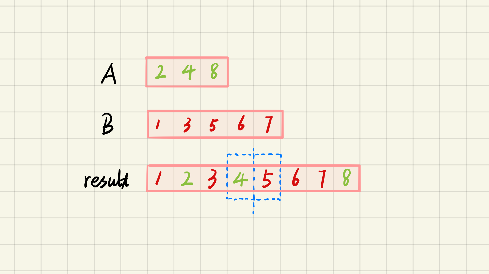
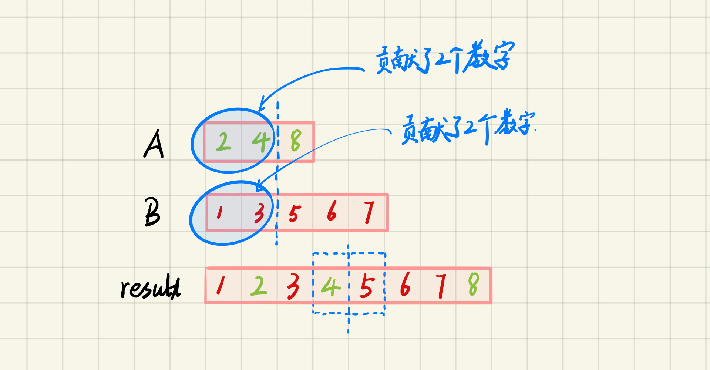
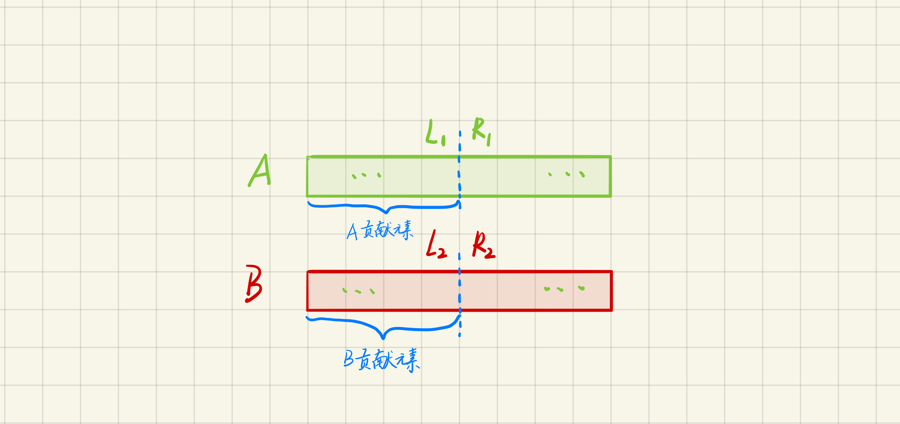

## 题目

### 题目难度：🔥🔥🔥 中等

给定两个大小分别为 `m` 和 `n` 的正序（从小到大）数组  `nums1` 和  `nums2`。请你找出并返回这两个正序数组的 中位数 。

算法的时间复杂度应该为 `O(log (m+n))` 。

### 示例 1

```bash
输入：nums1 = [1,3], nums2 = [2]
输出：2.00000
解释：合并数组 = [1,2,3] ，中位数 2
```

### 示例 2

```bash
输入：nums1 = [1,2], nums2 = [3,4]
输出：2.50000
解释：合并数组 = [1,2,3,4] ，中位数 (2 + 3) / 2 = 2.5


```

### 提示

- nums1.length == m
- nums2.length == n
- 0 <= m <= 1000
- 0 <= n <= 1000
- 1 <= m + n <= 2000
- -$10^6 <= nums1[i], nums2[i] <= $10^6

## 解法

### 解法一：数组归并

在两个有序的数组中要找到某个数，估计大家第一想到的就是归并的方法。这也是归并排序的基本思想。开辟一个新的数组 help，长度为两个数组的长度和。使用两个指针分别指向两个数组的开头，比较两个指针所指的元素，将比较小的元素放入到新的数组中。之后继续上述的操作，直到将所有的数都放入到 help 中。举一个简单的例子：将两个有序数组[1,3,5,6,7]与[2,4,8]合并为一个数组：
本题是要求找中位数，中位数就是两个数组长度和的一半的位置。但是这里要注意长度奇数偶数的情况：

- 如果总长度为奇数的话，那么合并后中间的那个数就是结果
- 如果总长度为偶数的话，那合并后中间两个数的平均数就是结果
  这里由于只需要找中位数，所以数组归并到中位数的位置就可以了，可以声明一个变量 k 作为跳出条件。

归并的方法简单易懂，时间复杂度与空间复杂度均为线性复杂度`O(m+n)`。并不符合题目要求。但是这种方法也是接下来方法的关键。

- 归并

```javascript
/**
 * @param {number[]} nums1
 * @param {number[]} nums2
 * @return {number}
 */
var findMedianSortedArrays = function (nums1, nums2) {
  let m = nums1.length,
    n = nums2.length,
    cnt = 0;
  let i = 0,
    j = 0,
    mid = (m + n + 1) >> 1;
  // 使用滚动数组，记录最近的两个数字，空间复杂度为O(1)
  let pre, cur;
  // 归并排序模板
  while (i < m || j < n) {
    if (j == n || (i < m && nums1[i] <= nums2[j])) cur = nums1[i++];
    else cur = nums2[j++];
    cnt++;
    // 每次可以获取到一个小数cur
    if ((m + n) & 1) {
      // 数字个数为奇数时，中位数为第 k/2+1个
      // 例如 1 2 3 4 5，有五个数字，则中位数为第3个
      if (cnt == mid) return cur;
      // 数字个数为偶数时，中位数为第 k/2+1和k/2+2两数的平均数
    } else if (cnt == mid + 1) return (pre + cur) / 2;
    pre = cur;
  }
};
```

- javascript 双指针
  因为是两个正序数组，所以使用双指针，顺序遍历(m+n)/2 次 即可找到中位数。

```javascript
/**
 * @param {number[]} nums1
 * @param {number[]} nums2
 * @return {number}
 */
var findMedianSortedArrays = function (nums1, nums2) {
  /**2 双指针顺序查找中位数 */
  let len = nums1.length + nums2.length;
  let loop = Math.ceil(len / 2) - 1; // 找到中位数的循环次数
  let o = (t = 0); // nums1,nums2的索引
  let num1 = (num2 = 0);
  let stopAtOne; // 标志在哪里停下来

  if (len % 2 == 0) {
    loop++; // 两个中位数，多循环一次
  }

  for (let i = 0; i <= loop; i++) {
    if (nums1[o] <= nums2[t] || t == nums2.length) {
      // num1值小 或 num2没有值了
      o++;
      stopAtOne = true;
    } else {
      t++;
      stopAtOne = false;
    }
  }
  if (stopAtOne) {
    num1 = nums1[o - 1];
  } else {
    num1 = nums2[t - 1];
  }

  if (len % 2 == 1) return num1;
  else {
    // 两个中位数
    if (stopAtOne) {
      // 从nums1停，说明nums1[o-1]是已遍历中最大的数，接下来找到第二大的数就可以求中位数了
      num2 =
        o - 2 < 0 || nums1[o - 2] < nums2[t - 1] ? nums2[t - 1] : nums1[o - 2];
    } else {
      // 反之 nums2[t-1]最大
      num2 =
        t - 2 < 0 || nums2[t - 2] < nums1[o - 1] ? nums1[o - 1] : nums2[t - 2];
    }
    return (num1 + num2) / 2;
  }

  /**1 大容器合并两个数组*/
  // let len = nums1.length + nums2.length;
  // let sum = [];
  // if (nums1.length == 0) {
  //     sum = nums2;
  // } else if (nums2.length == 0) {
  //     sum = nums1;
  // } else {
  //     let i = j = 0;
  //     for (let ii = 0; ii < len; ii++) {
  //         if (nums1[i] < nums2[j] || j==nums2.length) {
  //             sum[ii] = nums1[i]
  //             i++;
  //         } else{
  //             sum[ii] = nums2[j];
  //             j++;
  //         }
  //     }
  // }

  // let index = Math.ceil(len / 2) - 1;
  // if (len % 2 == 1) return sum[index];
  // return (sum[index] + sum[index + 1]) / 2;
};
```

### 解法二：二分查找

如何让时间复杂度降为`O(log(m+n))`呢？一般涉及到 log 的时间复杂度，我们都会想到二分查找的方法。其实这道题也不例外。我们仔细观察下面的例子：



题目要求找到中位数，通过计算我们知道中位数应当是 4,5 两个数的平均值，因为合并后数组的总长为 8，那么中位数就是位置 4,5 两处的数的均值。上图中蓝色的分割线将数组分为了两部分，现在我们只看左部分，左部分中数组 A 贡献了两个数（2,4），数组 B 贡献了两个数（1,3）。两个数组一共贡献了 4 个数。这四个数正好是中位数的位置。这也就说明了`数组 A 和数组 B 两个数组贡献的元素个数的和应该为数组的一半`。



如图所示，上图的情况一与情况二都满足数组 A 和数组 B 两个数组贡献的元素个数的和应该为数组的一半`（3+1）（0+4）`。但是都不符合要求：

情况一所构成的序列为：`[1,2,4,8]`，但是中间少了`3`，而多了`8`
情况二所构成的序列为：`[1,3,5,6]`，中间少了`2,4`,而多了`5,6`
将上述问题更一般化为：



如果不想出现上述的问题，我们需要保证 L1<R1 && L1<R2 L2<R1 && L2 < R2。由于题目中给的数组是有序的，故 L1 必然小于 R1，L2 必然小于 R2。这样才能构成一个正确的有序的序列，而不至于出现情况一与情况二的问题。

所以我们的序列必须满足以下条件：

- A 贡献的元素数量 + B 贡献的元素数量 = 要求的元素数量（本题是求中位数，故要求的为总数量的一半）
  > L1 < R2
  > L2 < R1
  > 整个问题基本就是这个样子，思路依旧来源于之前的方法一，只是将其细化进而转换思维方式。所以解任何题目，甚至是在科研学习当中，都不应该放弃最简单的方法，可能效率并不是特别高，但是却提供了一个能让我们继续思考下去的台阶。

如何快速的找到 L1 / R1 和 L2/ R2 的位置
这里就要用到二分查找了。由于 `A 贡献的元素数量 + B 贡献的元素数量 = 要求的元素数量`的限制，只要找到了 `L1 / R1` 的位置，也就找到的了 `L2/ R2` 。为了书写方便，将在数组 A 中的位置表示为 `curA`,在数组` B` 中位置表示为` curB`，（本题中 `curA + curB = (A.length + b.length +1)/2)`。

这样只需要在一个数组中进行二分查找了。我们选择长度比较短的数组作为查找数组：

由于数列是有序的，其实我们完全可以一半儿一半儿的排除。假设我们要找第 k 小数，我们可以每次循环排除掉 k/2 个数。看下边一个例子。

假设我们要找第 7 小的数字。


我们比较两个数组的第 k/2 个数字，如果 k 是奇数，向下取整。也就是比较第 3 个数字，上边数组中的 4 和下边数组中的
3，如果哪个小，就表明该数组的前 k/2 个数字都不是第 k 小数字，所以可以排除。也就是 1，2，3 这三个数字不可能是第 7 小的数字，我们可以把它排除掉。将 1349 和 45678910 两个数组作为新的数组进行比较。

更一般的情况 `A[1] ，A[2] ，A[3]，A[k/2] ... ，B[1]，B[2]，B[3]，B[k/2] ... `，如果 `A[k/2]<B[k/2]` ，那么`A[1]，A[2]，A[3]，A[k/2]`都不可能是第 `k` 小的数字。

A 数组中比 `A[k/2]` 小的数有 `k/2-1 `个，`B` 数组中，`B[k/2] `比 `A[k/2]` 小，假设 `B[k/2]` 前边的数字都比 `A[k/2]` 小，也只有 `k/2-1` 个，所以比 `A[k/2]` 小的数字最多有 `k/1-1+k/2-1=k-2`个，所以 `A[k/2] `最多是第 `k-1 `小的数。而比 `A[k/2]` 小的数更不可能是第 k 小的数了，所以可以把它们排除。
橙色的部分表示已经去掉的数字:


由于我们已经排除掉了 3 个数字，就是这 3 个数字一定在最前边，所以在两个新数组中，我们只需要找第 7 - 3 = 4 小的数字就可以了，也就是 k = 4。此时两个数组，比较第 2 个数字，3 < 5，所以我们可以把小的那个数组中的 1 ，3 排除掉了


我们又排除掉 2 个数字，所以现在找第 4 - 2 = 2 小的数字就可以了。此时比较两个数组中的第 k / 2 = 1 个数，4 == 4，怎么办呢？由于两个数相等，所以我们无论去掉哪个数组中的都行，因为去掉 1 个总会保留 1 个的，所以没有影响。为了统一，我们就假设 4 > 4 吧，所以此时将下边的 4 去掉


由于又去掉 1 个数字，此时我们要找第 1 小的数字，所以只需判断两个数组中第一个数字哪个小就可以了，也就是 4。

所以第 7 小的数字是 4。

我们每次都是取 k/2 的数进行比较，有时候可能会遇到数组长度小于 k/2 的时候。


此时 k / 2 等于 3，而上边的数组长度是 2，我们此时将箭头指向它的末尾就可以了。这样的话，由于 2 < 3，所以就会导致上边的数组 1，2 都被排除。造成下边的情况。


由于 2 个元素被排除，所以此时 k = 5，又由于上边的数组已经空了，我们只需要返回下边的数组的第 5 个数字就可以了。

从上边可以看到，无论是找第奇数个还是第偶数个数字，对我们的算法并没有影响，而且在算法进行中，k 的值都有可能从奇数变为偶数，最终都会变为 1 或者由于一个数组空了，直接返回结果。

所以我们采用递归的思路，为了防止数组长度小于 k/2，所以每次比较 min(k/2，len(数组) 对应的数字，把小的那个对应的数组的数字排除，将两个新数组进入递归，并且 k 要减去排除的数字的个数。递归出口就是当 k=1 或者其中一个数字长度是 0 了。

时间复杂度：每进行一次循环，我们就减少 k/2 个元素，所以时间复杂度是 O(log(k)，而 k=(m+n)/2，所以最终的复杂也就是 O(log(m+n）。
空间复杂度：虽然我们用到了递归，但是可以看到这个递归属于尾递归，所以编译器不需要不停地堆栈，所以空间复杂度为 O(1)。

```javascript
/**
 * @param {number[]} nums1
 * @param {number[]} nums2
 * @return {number}
 */
var findMedianSortedArrays = function (nums1, nums2) {
  let m = nums1.length,
    n = nums2.length;
  let mid = (m + n + 1) >> 1;
  let a = findK(0, 0, mid);
  if ((m + n) & 1) return a;
  let b = findK(0, 0, mid + 1);
  function findK(i, j, k) {
    if (i == m) return nums2[j + k - 1];
    if (j == n) return nums1[i + k - 1];
    if (k == 1) return nums1[i] < nums2[j] ? nums1[i] : nums2[j];

    let a = Math.min(k >> 1, m - i);
    let b = Math.min(k - a, n - j);
    a = k - b;
    if (nums1[i + a - 1] <= nums2[j + b - 1]) return findK(i + a, j, k - a);
    return findK(i, j + b, k - b);
  }
  return (a + b) / 2;
};
```

- python 3

  ```javascript

  class Solution:
    def findMedianSortedArrays(self, nums1: List[int], nums2: List[int]) -> float:
        def findKth(i, j, k):
            if i >= m:
                return nums2[j + k - 1]
            if j >= n:
                return nums1[i + k - 1]
            if k == 1:
                return min(nums1[i], nums2[j])
            midVal1 = nums1[i + k // 2 - 1] if i + k // 2 - 1 < m else inf
            midVal2 = nums2[j + k // 2 - 1] if j + k // 2 - 1 < n else inf
            if midVal1 < midVal2:
                return findKth(i + k // 2, j, k - k // 2)
            return findKth(i, j + k // 2, k - k // 2)

        m, n = len(nums1), len(nums2)
        left, right = (m + n + 1) // 2, (m + n + 2) // 2
        return (findKth(0, 0, left) + findKth(0, 0, right)) / 2

  ```

- java

```javascript
class Solution {
    public double findMedianSortedArrays(int[] nums1, int[] nums2) {
        int m = nums1.length;
        int n = nums2.length;
        int left = (m + n + 1) / 2;
        int right = (m + n + 2) / 2;
        return (findKth(nums1, 0, nums2, 0, left) + findKth(nums1, 0, nums2, 0, right)) / 2.0;
    }

    private int findKth(int[] nums1, int i, int[] nums2, int j, int k) {
        if (i >= nums1.length) {
            return nums2[j + k - 1];
        }
        if (j >= nums2.length) {
            return nums1[i + k - 1];
        }
        if (k == 1) {
            return Math.min(nums1[i], nums2[j]);
        }
        int midVal1 = (i + k / 2 - 1 < nums1.length) ? nums1[i + k / 2 - 1] : Integer.MAX_VALUE;
        int midVal2 = (j + k / 2 - 1 < nums2.length) ? nums2[j + k / 2 - 1] : Integer.MAX_VALUE;
        if (midVal1 < midVal2) {
            return findKth(nums1, i + k / 2, nums2, j, k - k / 2);
        }
        return findKth(nums1, i, nums2, j + k / 2, k - k / 2);
    }
}

```

- c++

  ```javascript
  class Solution {
  public:
    double findMedianSortedArrays(vector<int>& nums1, vector<int>& nums2) {
        int m = nums1.size();
        int n = nums2.size();
        int left = (m + n + 1) / 2;
        int right = (m + n + 2) / 2;
        return (findKth(nums1, 0, nums2, 0, left) + findKth(nums1, 0, nums2, 0, right)) / 2.0;
    }

    int findKth(vector<int>& nums1, int i, vector<int>& nums2, int j, int k) {
        if (i >= nums1.size()) return nums2[j + k - 1];
        if (j >= nums2.size()) return nums1[i + k - 1];
        if (k == 1) return min(nums1[i], nums2[j]);
        int midVal1 = i + k / 2 - 1 < nums1.size() ? nums1[i + k / 2 - 1] : INT_MAX;
        int midVal2 = j + k / 2 - 1 < nums2.size() ? nums2[j + k / 2 - 1] : INT_MAX;
        if (midVal1 < midVal2) return findKth(nums1, i + k / 2, nums2, j, k - k / 2);
        return findKth(nums1, i, nums2, j + k / 2, k - k / 2);
    }
  };

  ```

- Go

```javascript
func findMedianSortedArrays(nums1 []int, nums2 []int) float64 {
    m, n := len(nums1), len(nums2)
    left, right := (m+n+1)/2, (m+n+2)/2
    var findKth func(i, j, k int) int
    findKth = func(i, j, k int) int {
        if i >= m {
            return nums2[j+k-1]
        }
        if j >= n {
            return nums1[i+k-1]
        }
        if k == 1 {
            return min(nums1[i], nums2[j])
        }
        midVal1 := math.MaxInt32
        midVal2 := math.MaxInt32
        if i+k/2-1 < m {
            midVal1 = nums1[i+k/2-1]
        }
        if j+k/2-1 < n {
            midVal2 = nums2[j+k/2-1]
        }
        if midVal1 < midVal2 {
            return findKth(i+k/2, j, k-k/2)
        }
        return findKth(i, j+k/2, k-k/2)
    }
    return (float64(findKth(0, 0, left)) + float64(findKth(0, 0, right))) / 2.0
}

func min(a, b int) int {
    if a < b {
        return a
    }
    return b
}

```

### 解法三：优化

我们首先理一下中位数的定义是什么：中位数，其可将数值集合划分为相等的上下两部分。
所以我们只需要将数组进行切。

一个长度为 m 的数组，有 0 到 m 总共 m + 1 个位置可以切


我们把数组 A 和数组 B 分别在 i 和 j 进行切割


将 i 的左边和 j 的左边组合成「左半部分」，将 i 的右边和 j 的右边组合成「右半部分」。

- 当 A 数组和 B 数组的总长度是偶数时，如果我们能够保证

\*左半部分的长度等于右半部分

```bash
i + j = m - i  + n - j  , 也就是 j = ( m + n ) / 2 - i
```

\*左半部分最大的值小于等于右半部分最小的值 `max ( A [ i - 1 ] , B [ j - 1 ]）） <= min ( A [ i ] , B [ j ]））`

```bash
那么，中位数就可以表示如下

（左半部分最大值 + 右半部分最小值 ）/ 2。

（max ( A [ i - 1 ] , B [  j  - 1 ]）+ min ( A [ i ] , B [ j ]）） /  2
```

- 当 A 数组和 B 数组的总长度是奇数时，如果我们能够保证

\*左半部分的长度比右半部分大 1

```bash
i + j = m - i  + n - j  + 1也就是 j = ( m + n + 1) / 2 - i
```

\*左半部分最大的值小于等于右半部分最小的值 max ( A [ i - 1 ] , B [ j - 1 ]）） <= min ( A [ i ] , B [ j ]））

```bash
那么，中位数就是

左半部分最大值，也就是左半部比右半部分多出的那一个数。

max ( A [ i - 1 ] , B [  j - 1 ]）
```

上边的第一个条件我们其实可以合并为 j=(m+n+1)/2−i，因为如果 m+n 是偶数，由于我们取的是
int 值，所以加 1 也不会影响结果。当然，由于 0<=i<=m ，为了保证 0<=j<=n，我们必须保证 m<=n。

```bash

m≤n,i<m,j=(m+n+1)/2−i≥(m+m+1)/2−i>(m+m+1)/2−m=0
m≤n,i>0,j=(m+n+1)/2−i≤(n+n+1)/2−i<(n+n+1)/2=n
```

最后一步由于是 int 间的运算，所以

1/2=0。

而对于第二个条件，奇数和偶数的情况是一样的，我们进一步分析。为了保证 max ( A [ i - 1 ] , B [ j - 1 ]）） <= min ( A [ i ] , B [ j ]）），因为 A 数组和 B 数组是有序的，所以 A [ i - 1 ] <= A [ i ]，B [ i - 1 ] <= B [ i ] 这是天然的，所以我们只需要保证 B [ j - 1 ] < = A [ i ] 和 A [ i - 1 ] <= B [ j ] 所以我们分两种情况讨论：

B [ j - 1 ] > A [ i ]，并且为了不越界，要保证 j != 0，i != m

此时很明显，我们需要增加 i ，为了数量的平衡还要减少 j ，幸运的是 j = ( m + n + 1) / 2 - i，i 增大，j 自然会减少。

A [ i - 1 ] > B [ j ] ，并且为了不越界，要保证 i != 0，j != n


此时和上边的情况相反，我们要减少 i ，增大 j 。

上边两种情况，我们把边界都排除了，需要单独讨论。

当 i = 0, 或者 j = 0，也就是切在了最前边。


此时左半部分当 j = 0 时，最大的值就是 A [ i - 1 ] ；当 i = 0 时 最大的值就是 B [ j - 1] 。右半部分最小值和之前一样。

当 i = m 或者 j = n，也就是切在了最后边。


此时左半部分最大值和之前一样。右半部分当 j = n 时，最小值就是 A [ i ] ；当 i = m 时，最小值就是 B [ j ] 。

所有的思路都理清了，最后一个问题，增加 i 的方式。当然用二分了。初始化 i 为中间的值，然后减半找中间的，减半找中间的，减半找中间的直到答案。
