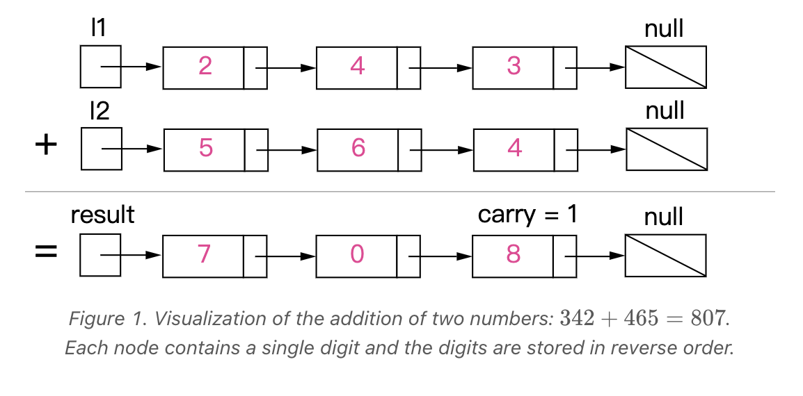

## 题目 🔥🔥 中等

给你一个字符串`s`，找到 `s` 中最长的回文子串。
如果字符串的反序与原始字符串相同，则该字符串称为回文字符串。

### 示例 1

```bash
输入：s = "babad"
输出："bab"
解释："aba" 同样是符合题意的答案。
```

### 示例 2

```bash
输入：s = "cbbd"
输出："bb"
```

#### 提示

```bash

1 <= s.length <= 1000
s 仅由数字和英文字母组成
```

## 解法

### 解法一：链表

#### 思路

模拟加法，逐位相加


#### 解题步骤

因为链表是逆序存储的，我们直接模拟加法，处理好进位就可以了。

- 定义单链表 `class` 节点或者 `function`
- 使用哑结点`（dummy）`，不用对头结点是否存在单独判断; 声明一个 `carry` 变量用于存储进位。
- `x` 的值为 `l1` 的 `val`，如果走到 `l1` 的尾部，设置为 `0`
- `y` 的值为 `l2` 的 `val`, 如果走到 `l2` 的尾部， 设置为 `0`
- 求和： `sum = val1 + val2 + carry`
- 求进位：`Math.floor(sum / 10)`
- 求链表对应的新值：`sum % 10`
- 创建新的结点，将新结点添加到链表中，并更新当前链表： `cur = cur.next`
- 更新 `l1` 和 `l2`

#### 图解


#### 复杂度

- 时间复杂度:
  `O(max(m,n))`，假设 `l1` 的长度是 `m`， `l2` 的长度是 `n`，时间复杂度就是两者的最大值。
- 空间复杂度:
  O(1)

#### code

```javascript
/**
 * Definition for singly-linked list.
 * function ListNode(val, next) {
 *     this.val = (val===undefined ? 0 : val)
 *     this.next = (next===undefined ? null : next)
 * }
 */
/**
 * @param {ListNode} l1
 * @param {ListNode} l2
 * @return {ListNode}
 */
var addTwoNumbers = function (l1, l2) {
  const dummy = new ListNode(0);
  let curr = dummy;
  let carry = 0;
  while (l1 !== null || l2 !== null || carry !== 0) {
    let x = l1 ? l1.val : 0;
    let y = l2 ? l2.val : 0;
    let sum = x + y + carry;
    carry = Math.floor(sum / 10);
    curr.next = new ListNode(sum % 10);
    curr = curr.next;
    l1 = l1 ? l1.next : null;
    l2 = l2 ? l2.next : null;
  }

  return dummy.next;
};
```

```javascript
/**
 * Definition for singly-linked list.
 * function ListNode(val, next) {
 *     this.val = (val===undefined ? 0 : val)
 *     this.next = (next===undefined ? null : next)
 * }
 */
/**
 * @param {ListNode} l1
 * @param {ListNode} l2
 * @return {ListNode}
 */
var addTwoNumbers = function (l1, l2) {
  const dummy = new ListNode(0);
  let cur = dummy;
  let carray = 0; // 进位记录
  while (l1 || l2 || carray) {
    let varl1 = l1?.val ?? 0;
    let varl2 = l2?.val ?? 0;
    let sum = varl1 + varl2 + carray;
    carray = Math.floor(sum / 10);
    cur.next = new ListNode(sum % 10);
    cur = cur.next;
    l1 = l1?.next ?? null;
    l2 = l2?.next ?? null;
  }

  return dummy.next;
};
```

java

```javascript

/**
 * Definition for singly-linked list.
 * public class ListNode {
 *     int val;
 *     ListNode next;
 *     ListNode(int x) { val = x; }
 * }
 */
class Solution {
    public ListNode addTwoNumbers(ListNode l1, ListNode l2) {
        ListNode pre = new ListNode(0);
        ListNode cur = pre;
        int carry = 0;
        while(l1 != null || l2 != null) {
            int x = l1 == null ? 0 : l1.val;
            int y = l2 == null ? 0 : l2.val;
            int sum = x + y + carry;

            carry = sum / 10;
            sum = sum % 10;
            cur.next = new ListNode(sum);

            cur = cur.next;
            if(l1 != null)
                l1 = l1.next;
            if(l2 != null)
                l2 = l2.next;
        }
        if(carry == 1) {
            cur.next = new ListNode(carry);
        }
        return pre.next;
    }
}

```
